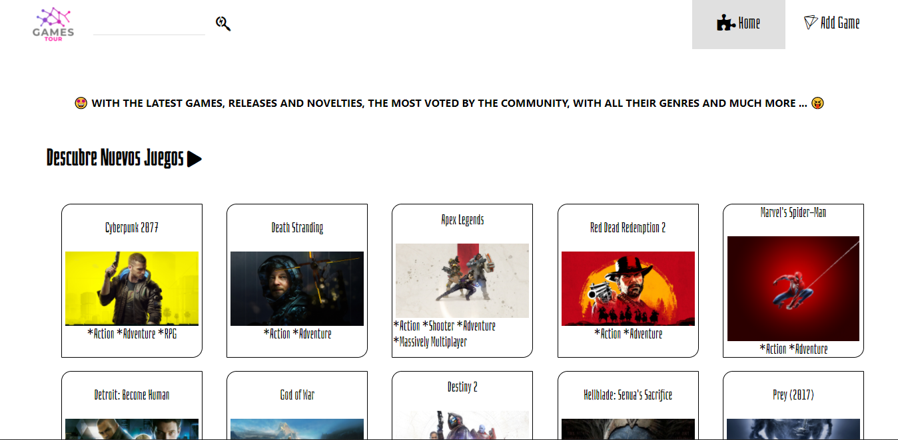
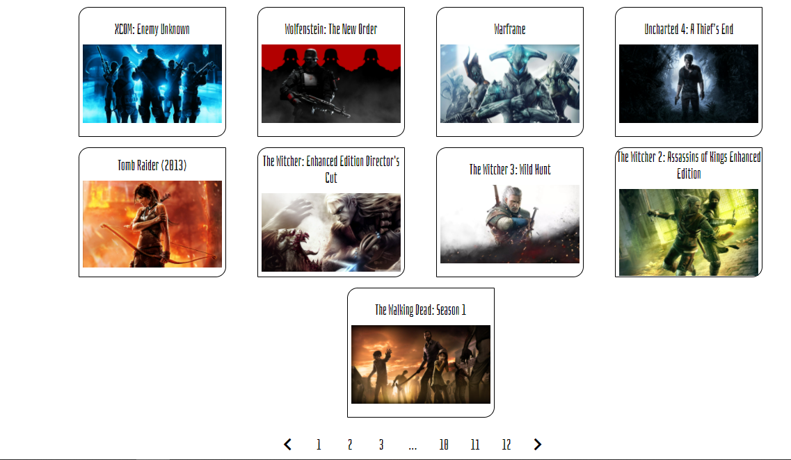
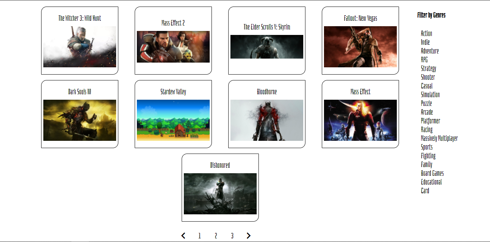
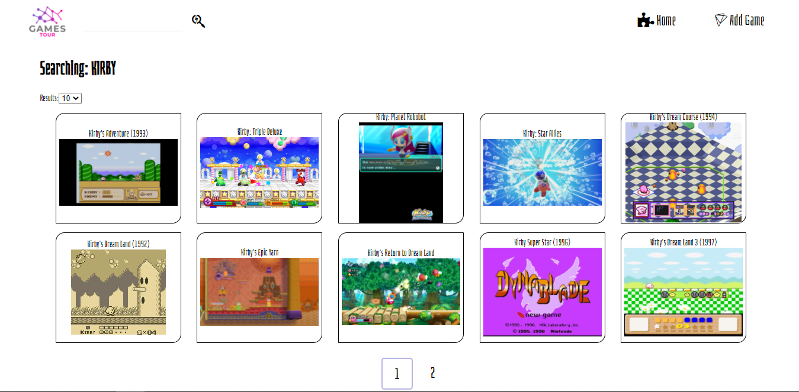
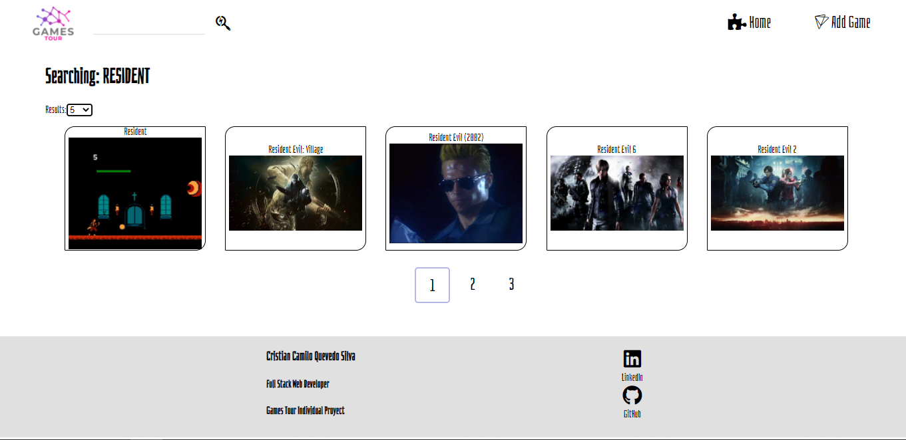
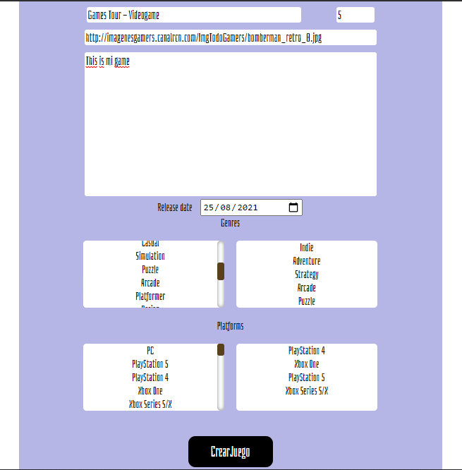
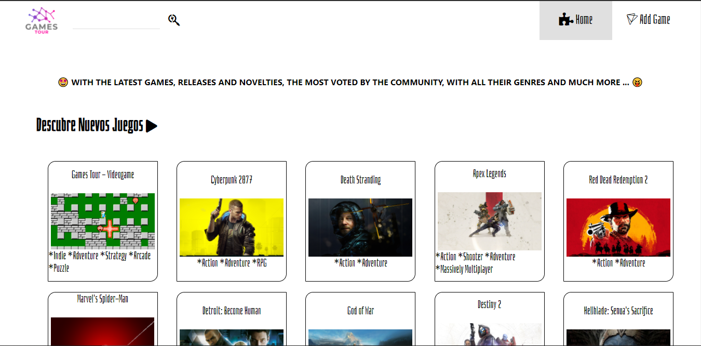
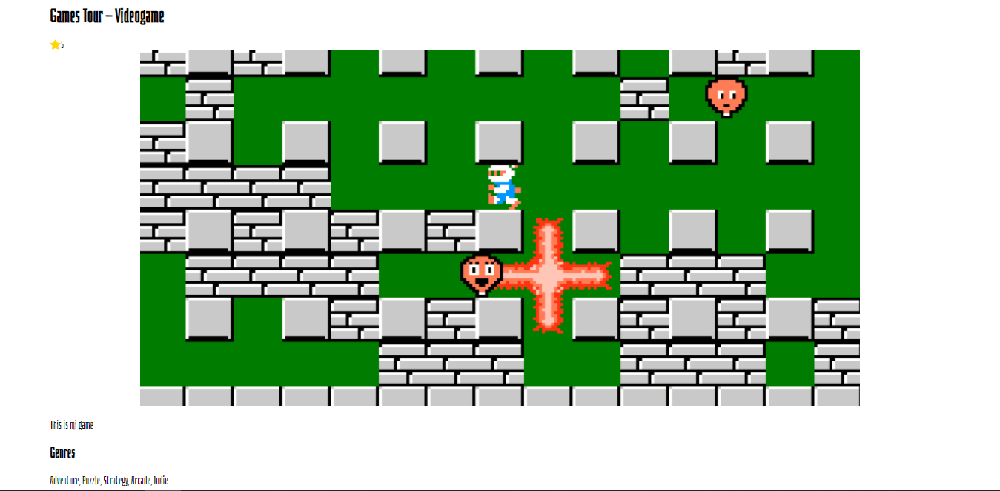

# GAMES TOUR - START 

  

## Data - API - BASE DE DATOS
Games Tour es una Single Page Aplication desarrollada como proyecto individual para Henry, esta usa Express para realizar solicitudes al API rawg.io y a una base de datos implementada con el orm Sequalize, obtener la data de multiples juegos para traerlas y mostrarlas dentro de la interfaz en el front.

  

## FILTROS Y ORDENAMIENTOS
Permite realizar ordenamientos por nombre, rating y fecha en que fueron lanzados además también de filtrar por géneros y realizar la paginación en base a la cantidad de resultados obtenidos.

  
  

## CONSULTAS
Permite buscar juegos con nombres iguales o similares al digitado, seleccionar la cantidad de resultados que se mostraran al mismo tiempo entre 5 y 15 por página.

  
  

## CREAR JUEGOS NEUVOS
Tiene un formulario que valida que todos los campos tengan información antes de poder crear el juego nuevo dentro de la base de datos. Se actualiza con la nueva información agregando el juego creado por el usuario con los de la API.

  
  

## DETALLES
Permite acceder a la información detallada de cualquiera de los juegos.

  

## TECNOLOGÍAS UTILIZADAS
- React
- Redux
- Node
- Express
- Sequalize
- Postgresql
- Javascript
- Css 